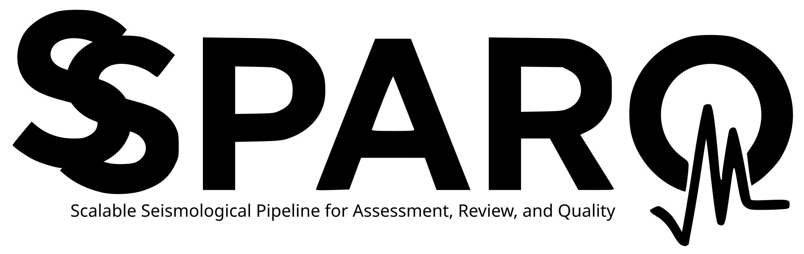

This repository contains reproducible material for the study **Scalable Seismological Pipeline for Assessment, Review, and Quality (SSPARQ) of Seismic Data** by *Diogo Luiz de Oliveira Coelho, André Vinícius de Sousa Nascimento, Gilberto da Silva Leite Neto, Marcelo Belentani de Bianchi, Ítalo Cley Borges de Santana Maurício, Eveline Alves Sayão, and Sergio Luiz Fontes*, submitted to **Seismological Research Letters**.

The provided codes is a [Python](https://www.python.org/)-based solution for processing seismological data to estimate:

- 🧭 Sensor misorientation
- ⏱️ Timing irregularities
- 🎚️ Instrumental gain variations

through **P-wave energy analysis** in three-component seismic recordings.

## 📦 Required Libraries 📦

The following libraries are used in this project:

#### Core Seismology & Signal Processing
- [obspy](https://github.com/obspy/obspy): Fundamental package for seismological data processing and analysis.
- [Scipy](https://scipy.org/): Scientific computing tools
- [scikit-learn](https://scikit-learn.org/): Machine learning tools (DBSCAN).

#### Data Handling
- [numpy](https://numpy.org/): Fundamental package for numerical computing
- [math](https://docs.python.org/3/library/math.html): Package to provide common mathematical functions and constants.
- [pandas](https://pandas.pydata.org/): Data analysis and manipulation
- [os](https://docs.python.org/3/library/os.html): Operating system interfaces
- [glob](https://docs.python.org/3/library/glob.html): Unix-style pathname pattern expansion
- [datetime](https://docs.python.org/3/library/datetime.html): Date/time handling

#### Parallel Processing
- [multiprocessing](https://docs.python.org/3/library/multiprocessing.html): Parallel processing capabilities

#### Progress & Utility
- [tqdm](https://github.com/tqdm/tqdm): Progress bars for loops
- [kneed](https://kneed.readthedocs.io/en/latest/#): Library to identify the knee/elbow point of a line fit to the data.

#### Visualization & Mapping
- [matplotlib](https://matplotlib.org/): Comprehensive plotting library
- [cartopy](https://scitools.org.uk/cartopy/): Geographic mapping and projections


## 🖱️ Installation 🖱️

To use the provided notebooks, install the required dependencies:

```bash
# Core packages
pip install obspy scikit-learn tqdm kneed

# Visualization
pip install cartopy shapely pyproj
```

## 🏗️ Repository structure 🏗️

```plaintext
📦 root
├── 📄 README.md                                                 # Project overview and instructions
│  
├── 📄 config_file.cnf                                           # Global configuration file for paths/parameters
│
├── 📂 parameters_py/                                            # Folder containing the parameters module
│   └── 📄 config.py                                             # Module that parses/manages global parameters
│
├── 📂 src/                                                      # Folder the core python modules created  
│   └── 📄 analysis.py                                           # Main algorithms for metric estimation
│   └── 📄 utils.py                                              # Utility functions for data handling 
│   └── 📄 plot.py                                               # Functions for diagnostic and summary plots
│
├── 📑 SSPARQ_estimative.ipynb                                   # Notebook for metrics estimation   
├── 📑 SSPARQ_earthquake_plot.ipynb                              # Notebook for diagnostic plots  
├── 📑 SSPARQ_results_plot.ipynb                                 # Notebook for summarize results
│
├── 📂 Sample/                                                   # Folder with reproducible material  
│   ├── 📂 XML/                                                  # Folder for stations input metadata
│   │   └── 📄 US.MVCO.xml                                       # Metadata for the US.MVCO station  
│   ├── 📂 CATALOG/                                              # Event origin and focal information  
│   │   └── 📄 CMTSOLUTIONS_2005_2025.xml                        # CMT solutions for EQ (2005–2025) 
│   ├── 📂 MSSED/                                                #  Raw seismic waveform data from MVCO station
│   │   └── 📂 2010/  
│   │       └── 📂 139/  
│   │           └── 📂 2010.139.04.15.45/  
│   │               └── 📄 US.MVCO..BHZ.2010.139.04.15.45        # Vertical (Z) component waveform 
│   │               └── 📄 US.MVCO..BHN.2010.139.04.15.45        # North-South (N) component waveform 
│   │               └── 📄 US.MVCO..BHE.2010.139.04.15.45        # East-West (E) component waveform
│   ├── 📂 OUTPUT/                                               # Output results and generated figures  
│   │   ├── 📂 FEATHER_FILES/                                    # Output dataframes (in Feather format)  
│   │   └── 📂 FIGURES/                                          # Resulting plots and figures
│   │       └── 📂 EARTHQUAKES/                                  # Diagnostic plots for individual earthquakes
│   │       └── 📂 FINAL_RESULT/                                 # Summary figures for station-level results
│
├── 📄 LICENSE.txt                                               # Project license information
│   
├── 📂 Extra/                                                    # Extra jupyter notebooks  


```

## 📑 Notebooks 📑

Automatically estimate and classify earthquake waveforms by processing seismic data from the sample folder.

The following notebooks are provided:

- 📔 ``SSPARQ_estimative.ipynb``
- 📔 ``SSPARQ_earthquake_plot.ipynb``
- 📔 ``SSPARQ_results_plot.ipynb``

## ⌨️ Usage ⌨️

1. Clone this repository:
   ```bash
   git clone <repository_url>
   cd Codes_Ocean_drones_monitoring_earthquakes_in_ultradeep_waters
   ```
2. Open the Jupyter Notebook environment:
   ```bash
   jupyter-lab
   ```
3. Run the following notebooks to reproduce the results:
- Estimate earthquake metrics from raw seismic data:
   - `SSPARQ_estimative.ipynb`
- Generate diagnostic plots for individual earthquakes:
   - `SSPARQ_earthquake_plot.ipynb`
- Summarize and visualize results across all stations:
   - `SSPARQ_results_plot.ipynb`

## 🧮 Algorithm 🧮

#### **Automated Earthquake Analysis Workflow**

The figure below summarizes the automated processing pipeline used to analyze earthquake waveforms and classify seismic events. It also highlights the associated input database.


## 📝 License 📝 

This project is licensed under the BSD 3-Clause License. See the `LICENSE` file for details.

## 📚 References 📚  

The implementation of the algorithms and methods in this repository is based on the following key references: 

- Pornsopin, P., Pananont, P., Furlong, K.P. et al. **Sensor orientation of the TMD seismic network (Thailand) from P-wave particle motions**. *Geosci. Lett*. 10, 24 (2023). https://doi.org/10.1186/s40562-023-00278-7.

- Braunmiller, J.,J. Nabelek, and A. Ghods (2020). **Sensor Orientation of Iranian Broadband Seismic Stations from P-Wave Particle Motion**, *Seismol. Res. Lett*. 91, 1660–1671, doi: 10.1785/0220200019.

- Zhu, G., H. Yang,J. Lin, and Q. You (2020). **Determining the Orientation of Ocean-Bottom Seismometers on the Seafloor and Correcting for Polarity Flipping via Polarization Analysis and Waveform Modeling**, *Seismol. Res. Lett*. XX, 1–12, doi: 10.1785/0220190239.

- L. Krischer, T. Megies, R. Barsch, M. Beyreuther, T. Lecocq, C. Caudron, J. Wassermann (2015). **ObsPy: a bridge for seismology into the scientific Python ecosystem**.
*Computational Science & Discovery*, 8(1), 014003. DOI: 10.1088/1749-4699/8/1/014003.

- M. Beyreuther, R. Barsch, L. Krischer, T. Megies, Y. Behr and J. Wassermann (2010). **ObsPy: A Python Toolbox for Seismology**.*Seismol. Res. Lett*, 81(3), 530-533. DOI: 10.1785/gssrl.81.3.530.

## 🔖 Disclaimer 🔖  

All experiments were conducted on two different setups running **Debian GNU/Linux 12 (Bookworm)**:  

- 💻 **AMD Ryzen 7 5700U** with **10 GB RAM**  
- 💻 **Intel® Core™ Ultra 9** with **64 GB RAM**  

📣 **Multiprocessing is implemented.**  

---
For further details, refer to the paper associated with this repository.